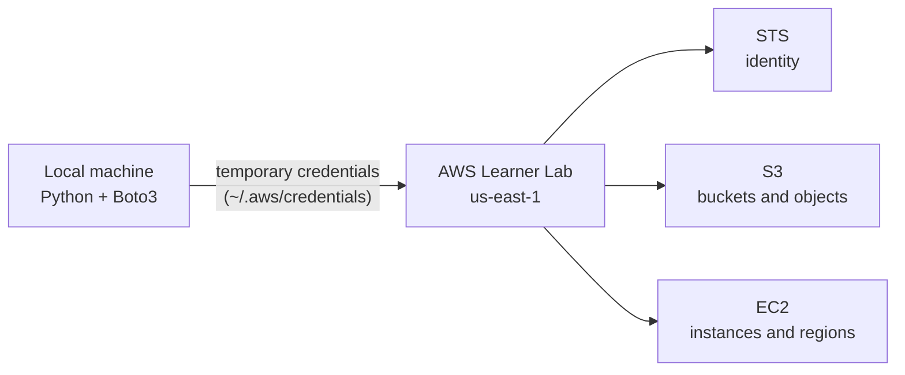

<div align="center">

# Boto3 & AWS Academy Learner Lab

**Hands-on AWS automation with Python, built lab by lab inside a restricted, temporary-credentials sandbox.**


[Overview](#overview) · [Labs](#labs) · [Quick start](#quick-start) · [Credentials](#credentials-every-session) · [Usage](#usage) · [Engineering practices](#engineering-practices) · [Troubleshooting](#troubleshooting) · [Roadmap](#roadmap)

</div>

---

## Overview

This repository contains a progressive series of labs that automate AWS with **Python and Boto3**. Every lab runs inside the **AWS Academy Learner Lab**, where credentials are temporary, IAM is restricted and resources are billed against a shared budget. Working under those constraints is deliberate: it forces the habits that matter in real cloud work.

**What this project demonstrates**

- Configuring and verifying temporary AWS credentials, and recovering from their expiry.
- Using both Boto3 interfaces, **clients** and **resources**, and knowing when to choose each.
- Reading nested API responses safely and handling optional fields without crashing.
- Applying production patterns: **paginators**, **waiters**, **error handling by error code**, **logging** and **systematic cleanup**.
- Building small but complete command-line tools with clear, recoverable error messages.




## Labs

| Lab | Folder | Services | Deliverable | Key pattern | Statement |
|-----|--------|----------|-------------|-------------|-----------|
| 0 | [`lab0-aws-environment-setup`](./lab0-aws-environment-setup) | STS | Working environment and connection test | Temporary credentials | [PDF](./lab0-aws-environment-setup/enonce/lab0_enonce.pdf) |
| 1 | [`lab1-aws-boto3-fundamentals`](./lab1-aws-boto3-fundamentals) | STS, S3, EC2 | `aws_resource_explorer.py` | Clients vs resources | [PDF](./lab1-aws-boto3-fundamentals/enonce/lab1_enonce.pdf) |
| 2 | [`lab2-aws-boto3-s3-file-management`](./lab2-aws-boto3-s3-file-management) | S3 | `s3_manager.py` | Paginators | [PDF](./lab2-aws-boto3-s3-file-management/enonce/lab2_enonce.pdf) |

### Lab 0: Environment setup

Prepares everything the other labs depend on: starting a Learner Lab session, loading credentials into `~/.aws`, creating a virtual environment, and running a connection test with STS. It also documents the platform limits, the `LabRole` workaround for Lambda, and a translation table for the most common AWS error codes.

### Lab 1: AWS Resource Explorer

A single script that reports on the account it is connected to.

- Identity (account, user ID, ARN) through STS.
- The region Boto3 actually resolved, read from a `Session` instead of being hardcoded.
- S3 buckets listed **twice**, with a client and with a resource, to compare both APIs.
- EC2 instances, traversing the nested `Reservations > Instances` structure and tolerating untagged instances.
- The available AWS regions, printed in aligned columns.
- Graceful failure on `NoCredentialsError` and `ClientError`, with a dedicated message for expired tokens.

### Lab 2: S3 File Manager

A menu-driven CLI for buckets and objects.

| Option | Action | Notes |
|--------|--------|-------|
| 1 | Create bucket | Handles the `us-east-1` location-constraint asymmetry |
| 2 | List buckets | |
| 3 | Upload file | Managed transfer with `upload_file`, local existence check first |
| 4 | List files | Paginated, optional prefix filter, size totals |
| 5 | Download file | Clear message for missing objects |
| 6 | Delete file | |
| 7 | Generate presigned URL | Configurable expiry |
| 8 | Delete bucket | Typed confirmation, guidance on `BucketNotEmpty` |
| 9 | Backup local folder | Recursive upload that preserves the folder structure as key prefixes |

## Repository structure

```text
boto3-aws-academy-learner-lab/
├── lab0-aws-environment-setup/
│   └── enonce/lab0_enonce.pdf
├── lab1-aws-boto3-fundamentals/
│   ├── aws_resource_explorer.py
│   └── enonce/lab1_enonce.pdf
├── lab2-aws-boto3-s3-file-management/
│   ├── s3_manager.py
│   └── enonce/lab2_enonce.pdf
├── requirements.txt
├── .gitignore
├── LICENSE
└── README.md
```

## Prerequisites

- **Python 3.9 or newer**
- **Git**
- Access to the **AWS Academy Learner Lab**

## Quick start

```bash
git clone https://github.com/<your-username>/boto3-aws-academy-learner-lab.git
cd boto3-aws-academy-learner-lab

python -m venv venv

# Windows (PowerShell)
venv\Scripts\Activate.ps1
# Linux / macOS
source venv/bin/activate

pip install -r requirements.txt
```

## Credentials (every session)

Learner Lab credentials are **temporary**. They change each time you press **Start Lab** and expire when the **4-hour** session ends.

1. In the Learner Lab, click **Start Lab** and wait for the indicator next to AWS to turn green.
2. Open **AWS Details**, click **Show** beside AWS CLI, and copy **all three lines**.
3. Paste them into `~/.aws/credentials`, replacing the previous content. On Windows the file is `C:\Users\<you>\.aws\credentials`, with no extension.

```ini
[default]
aws_access_key_id     = ASIA...
aws_secret_access_key = ...
aws_session_token     = ...
```

4. Set the region in `~/.aws/config`:

```ini
[default]
region = us-east-1
output = json
```

5. Verify the connection before running anything else:

```python
import boto3

print(boto3.client("sts").get_caller_identity())
print("Region:", boto3.session.Session().region_name)
```

> `get_caller_identity()` needs no permissions. If it fails, the problem is your credentials, never your IAM policy.

## Usage

```bash
# Lab 1: inspect the account
python lab1-aws-boto3-fundamentals/aws_resource_explorer.py

# Lab 2: manage S3 interactively
python lab2-aws-boto3-s3-file-management/s3_manager.py
```

<details>
<summary><strong>Sample output: Lab 1</strong></summary>

```text
  WHO AM I?
Account ID : 123456789012
ARN        : arn:aws:sts::123456789012:assumed-role/voclabs/user3021

  CURRENT REGION
Region  : us-east-1
Profile : default

  S3 BUCKETS (via client)
  youssef-lab1-demo    created 2026-09-01 10:14
Total: 1 bucket(s)

  EC2 INSTANCES
No EC2 instances in this region.
```

</details>

<details>
<summary><strong>Sample output: Lab 2, listing objects</strong></summary>

```text
Choose an option: 4
Bucket name: youssef-lab2-demo
Prefix filter (Enter for all):

KEY                                                        SIZE  MODIFIED
--------------------------------------------------------------------------
backup/docs/notes.txt                                     1,204  2026-09-01 11:02
backup/images/logo.png                                   48,110  2026-09-01 11:02
report.csv                                                8,940  2026-09-01 10:55

3 object(s), 0.06 MB total
```

</details>

## Engineering practices

| Practice | Why it matters | Where |
|----------|----------------|-------|
| Branch on `e.response["Error"]["Code"]`, never on the message | Codes are a stable contract; messages are reworded by AWS | Labs 1, 2 |
| Use paginators for listings | `list_objects_v2` returns at most 1000 keys per call | Lab 2 |
| Read optional fields with `.get()` | Untagged instances and empty buckets omit keys entirely | Labs 1, 2 |
| Validate local input before calling AWS | A local mistake should not become an AWS error | Lab 2 |
| Require typed confirmation for destructive actions | A deliberate act prevents reflexive deletions | Lab 2 |
| Re-raise unknown errors | Swallowing unexpected failures hides real bugs | Labs 1, 2 |
| Normalise path separators to `/` in S3 keys | On Windows a backslash would create one oddly named object | Lab 2 |
| Clean up after every session | Idle resources consume the shared budget | All labs |

Example of the error-handling pattern used throughout:

```python
from botocore.exceptions import ClientError

try:
    s3.download_file(bucket, key, dest)
except ClientError as e:
    code = e.response["Error"]["Code"]
    if code == "404":
        print("That object does not exist.")
    else:
        raise  # never swallow the unknown
```

## Learner Lab constraints

| Area | Limit | What to do |
|------|-------|------------|
| Regions | `us-east-1` and `us-west-2` only | Use `us-east-1` everywhere |
| EC2 types | nano to large | Prefer `t3.micro` |
| EC2 capacity | 9 instances, 32 vCPU per region | Launch one at a time, terminate when done |
| IAM | No users, groups or roles can be created | Use the pre-existing `LabRole` |
| Key pairs | `vockey` already exists | Pass `KeyName="vockey"` |
| Session | 4 hours, then everything stops | Press Start Lab to reset |
| S3 names | Globally unique | Prefix with a personal identifier |

## Security

- **Never commit credentials.** They live in `~/.aws/`, outside the repository, and `.gitignore` blocks `.env`, `*.pem`, `*.key` and similar files.
- Before pushing, confirm that nothing sensitive is tracked:

```bash
git ls-files | grep -iE "credentials|\.pem|\.env"
```

- Keep **Block Public Access** enabled on every bucket and share objects with presigned URLs.
- Even though Learner Lab tokens expire, treat them as secrets: a leaked key is still a bad habit to build.

## Troubleshooting

| Error | Cause | Fix |
|-------|-------|-----|
| `ExpiredToken` | Session token expired | Press Start Lab and re-copy all three lines |
| `InvalidClientTokenId` | Partial or stale credentials block | Re-copy the full block |
| `NoCredentialsError` | Boto3 found no credentials | Check the path and spelling of `~/.aws/credentials` |
| `NoRegionError` | No region resolved | Add `region = us-east-1` to `~/.aws/config` |
| `UnauthorizedOperation` | Forbidden instance type or region | Use `t3.micro` in `us-east-1` |
| `BucketAlreadyExists` | Name owned by another account | Add a personal prefix |
| `BucketNotEmpty` | Objects still inside | Delete every object, then the bucket |
| `KeyError: 'Tags'` or `'Contents'` | Optional key absent | Use `.get("...", [])` |
| `ModuleNotFoundError: boto3` | Wrong interpreter or venv inactive | Activate the venv, then `pip install -r requirements.txt` |

## End-of-session cleanup

Run through this before closing your laptop:

- [ ] Every EC2 instance is **terminated**, not merely stopped (a stopped instance still bills for its EBS volume).
- [ ] Every S3 bucket you created is emptied and deleted.
- [ ] Every DynamoDB table and Lambda function you created is deleted.
- [ ] The AWS Console shows nothing left that belongs to you.
- [ ] Your work is committed and pushed.

> **Golden rule:** if you created it, you destroy it.

## Roadmap

- [x] Lab 0: environment setup and connection test
- [x] Lab 1: Boto3 fundamentals, clients vs resources
- [x] Lab 2: S3 file manager with paginators
- [ ] Lab 3: EC2 lifecycle with waiters
- [ ] Lab 4: DynamoDB tables and conditional writes
- [ ] Lab 5: Lambda deployment with `LabRole`
- [ ] Shared toolkit module (logging, retries, configuration) reused across labs

## Resources

- [Boto3 documentation](https://boto3.amazonaws.com/v1/documentation/api/latest/index.html)
- The PDF statement inside each lab's `enonce/` folder

## Author

Ons Ajmi
Cloud Infrastructure Management Engineering Student at TEK-UP University, Tunisia.

🐙 GitHub:(https://github.com/<your-username>)  
💼 LinkedIn:(https://www.linkedin.com/in/<your-profile>)

## License

Released for educational purposes under the [MIT License](./LICENSE).
